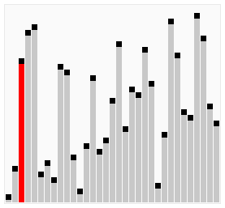

# 버블정렬

### [ 문제 ]

- 주어진 배열을 버블정렬을 이용해 오름차순 혹은 내림차순으로 정렬합니다.

### [ 조건 ]

- Arrays.sort() 사용 금지

### [ 예시 ]

|                   입력                    | -> |                출력                 |
|:---------------------------------------:|----|:---------------------------------:|
| [ 5, 7, 2, 9, 10, 6, 1, 3, 4, 8 ] , ASC |    | [ 1, 2, 3, 4, 5, 6, 7, 8, 9, 10 ] |

|                    입력                    | -> |                출력                 |
|:----------------------------------------:|----|:---------------------------------:|
| [ 6, 1, 3, 4, 8, 5, 7, 2, 9, 10 ] , DESC |    | [ 10, 9, 8, 7, 6, 5, 4, 3, 2, 1 ] |