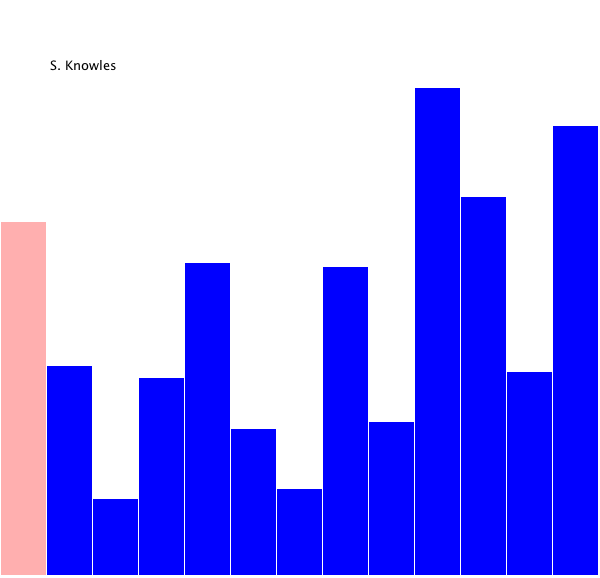

# 선택정렬

### [ 설명 ]

- 배열에서 최소 혹은 최대값을 찾아 해당 데이터를 swap하는 방법
- 시간 복잡도 : O(n^2)

1. 정렬에서 최소 혹은 최대값을 찾습니다.
2. 최소값을 찾는 경우 가장 앞에 있는 값과 swap, 최대값을 찾는 경우 가장 뒤에 있는 값과 swap 합니다.
3. swap한 가장 앞 혹은 가장 뒤의 값을 제외한 배열을 대상으로 1, 2번을 반복합니다.

### [ 문제 ]

- 주어진 문자열을 선택 정렬으로 오름차순 정렬합니다.

### [ 조건 ]

- Arrays.sort() 사용 금지

### [ 예시 ]

|   입력    | -> |    출력   |
|:---------:|----|:---------:|
| 572961348 |    | 123456789 |

|   입력    | -> |    출력   |
|:---------:|----|:---------:|
| 83014729 |    | 01234789 |

|   입력     | -> |     출력    |
|:----------:|----|:----------:|
| 5359713250 |    | 0123355579 |