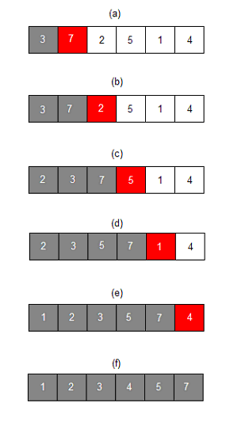

# 삽입정렬

### [ 설명 ]

- 특정 값을 선택해 이미 정렬된 데이터 범위의 적절한 위치에 삽입하는 정렬
- 시간 복잡도 : O(n^2)

1. 현재 데이터 값을 임시 저장합니다.
2. 선택된 데이터를 기준으로 정렬된 데이터 범위에서의 적절한 위치를 찾습니다.
3. 찾은 적절한 위치부터 기존의 위치까지 shift 연산을 수행합니다.
4. shift 후 적절한 위치에 선택한 데이터를 삽입합니다.
5. 다음 데이터 값을 기준으로 1-4번까지 반복합니다.

### [ 문제 ]

- 주어진 문자열을 삽입 정렬으로 오름차순 정렬합니다.

### [ 조건 ]

- Arrays.sort() 사용 금지

### [ 예시 ]

|   입력    | -> |    출력   |
|:---------:|----|:---------:|
| 759618324 |    | 123456789 |

|   입력    | -> |    출력   |
|:---------:|----|:---------:|
| 473823019 |    | 012334789 |

|   입력     | -> |     출력    |
|:----------:|----|:----------:|
| 53950971392 |    | 01233557999 |