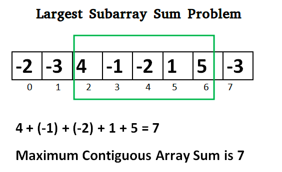

= Kadane's Algorithm

* 최대 구간 합 (maximum subarray problem)
* N개의 정수로 구성된 배열 arr[]이 있습니다.
* 최대 합계를 갖는 연속되는 하위 배열을 찾아 합계를 구해 반환 합니다.
* 하위 배열은 최소 하나의 숫자를 포함해야 합니다.

== example
----
n=5, arr[]={1,2,3,-2,5}
result : 9
----

----
n=4,arr[]={-1,-2,-3,-4}
result : -1
----

----
n=6, arr[]={-2,-3,4,-1,-2,1,5,-3}
result = 7
----

== Solution

* Test 코드가 통과하도록 구현합니다.

[java]
----
public class Solution {
  public long maxSubarraySum(int arr[]){
    return 0l;
  }
}
----

== 공부거리
* https://en.wikipedia.org/wiki/Maximum_subarray_problem
* https://www.javatpoint.com/kadanes-algorithm