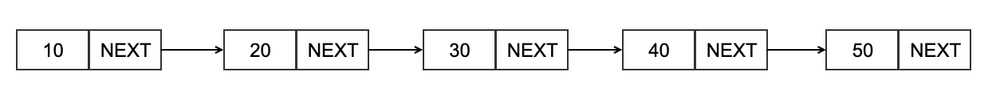
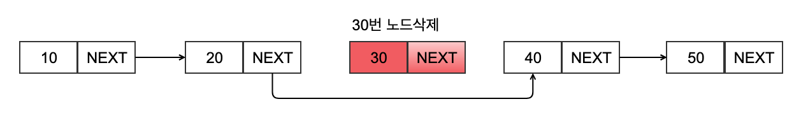
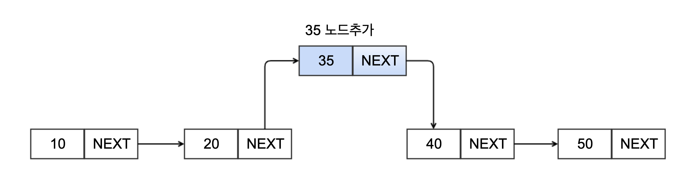

= Singly linked list

* 아래 이미지를 참고하여 구현합니다.

== Node.java

[source,java]
----
public class Node<E> {

    private final E data;
    private Node<E> next;

}
----

== NodeUtils.java

[source,java]
----
public class NodeUtils {

    public static Node findNode(Node head, Node find) {
        Node result = null;
        // TODO : head 노드로부터 find node 찾기

        return result;
    }

    public static String printNode(Node head) {
        StringBuilder sb = new StringBuilder();
        // TODO : head 노드에서부터 모든 노드를 다음과 같이 반환하도록 구현합니다.
        // 10->20->30->40->50

        return sb.toString();
    }

    public static Node removeFirst(Node head) {
        // TODO : head node를 삭제하고 새로운 head node를 반환합니다.

        return head;
    }

    public static void removeNode(Node head, Node find) {
        // TODO : remove node

    }
}
----

== Test Code
* Test Code가 통과하도록 구현합니다.

[source,java]
----
include::../../../../../test/java/com/again/day0315/NodeUtilsTest.java[]
----

[source,java]
----
include::../../../../../test/java/com/again/day0315/NodeTest.java[]
----