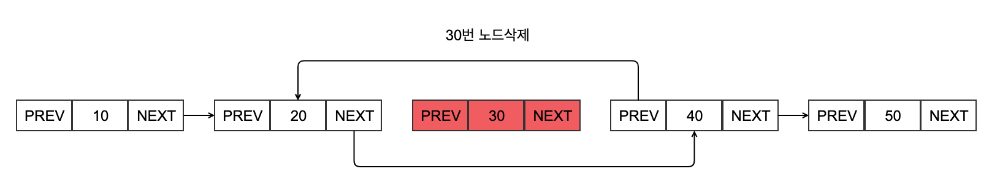
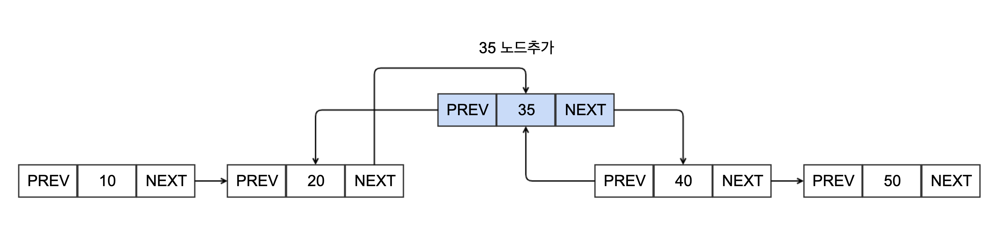

= Doubly Linked List

* 이중 연결리스트 구현

== 설명

* node 생성

* node 삭제
** 30노드 index(2) find
** node(30) prev 이전노드(node(20)의 next 노드에 node(30)의 next 노드(node(40))로 참조 합니다.

* node 추가
** node(35) 생성합니다.
** node(20) index(1) find
** node(35) next에  node(20)의 next 노드(node(40)) 를 참조 합니다.
** node(35) prev에 node(20)을 참조 합니다.
** node(20)의 next 노드에 node(35) 참조 합니다.

== Node.java

[source, java]
----
package com.nhnacademy;

import java.util.Objects;

public class Node<E> {

    private final E data;
    private Node<E> next;
    private Node<E> prev;
}
----

== NodeUtils.java

[source,java]
----
@Slf4j
public class NodeUtils {

    public static Node findNode(Node head, Node find){
        //todo : head 노드에서 find

        return null;
    }

    public static Node findNodeByIndex(Node head, int index){
        //todo head 노드로 부터 index 번째 노드 탐색, index는 0 부터 시작합니다.
        return null;
    }

    public static String printNode(Node head){
        StringBuilder sb = new StringBuilder();
        //todo: head 노드에서부터 모든 노드를 다음과 같이 반환하도록 구현합니다.
        //10->20->30->40->50

        return sb.toString();
    }

    public static Node removeFirst(Node head){
        //todo head node를 삭제하고 새로운 head node를 반환합니다.
        return null;
    }

    public static void removeNode(Node head, Node find){
        //todo node 삭제
    }

    public static void removeNodeByIndex(Node head, int index){
        //todo index 번째 노드 삭제
    }

    public static int getSize(Node head){
        //node의 size 반환
        int size=0;

        return size;
    }

}
----

== Test Code

[source,java]
----
include::../../../../../test/java/com/again/day0317/NodeUtilsTest.java[]
----

https://www.baeldung.com/java-new-custom-exception